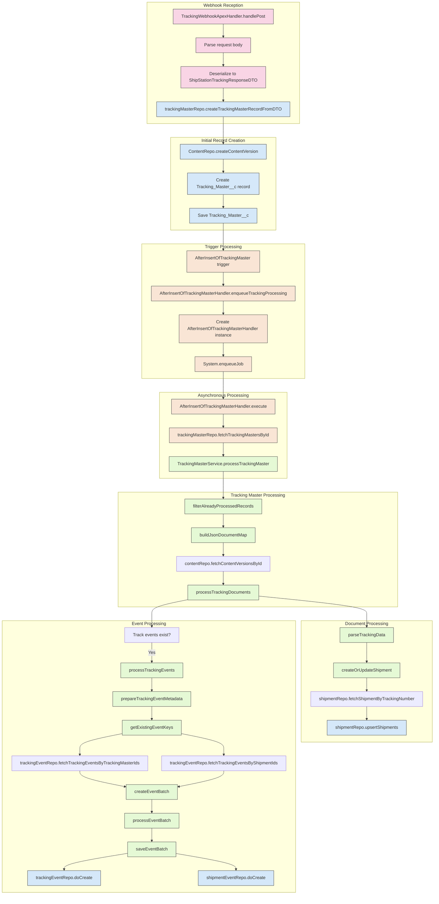

# ShipStation Webhook Processing Flow

## Flow Description

1. **Webhook Reception**

    - A webhook payload is sent to the `TrackingWebhookApexHandler.handlePost` method
    - The request body is parsed and deserialized into a `ShipStationTrackingResponseDTO` object
    - The `TrackingMasterRepo` is used to create a tracking master record from the DTO

2. **Initial Record Creation**

    - The `ContentRepo` creates a `ContentVersion` record to store the raw webhook JSON
    - A `Tracking_Master__c` record is created with data from the webhook payload
    - The record is inserted into the database

3. **Trigger Processing**

    - The `AfterInsertOfTrackingMaster` trigger fires after the `Tracking_Master__c` record is inserted
    - The trigger calls the `AfterInsertOfTrackingMasterHandler.enqueueTrackingProcessing` method
    - A new `AfterInsertOfTrackingMasterHandler` instance is created with the tracking master IDs
    - The handler is enqueued as a queueable job using `System.enqueueJob`

4. **Asynchronous Processing**

    - The queueable job's `execute` method is called by the Salesforce platform
    - The `TrackingMasterRepo` fetches the tracking master records by their IDs
    - The `TrackingMasterService.processTrackingMaster` method is called to process the records

5. **Tracking Master Processing**

    - Already processed records are filtered out
    - The JSON documents stored in ContentVersion records are retrieved
    - The tracking documents are processed to create or update shipment records

6. **Document Processing**

    - The tracking data is parsed from the JSON documents
    - Shipment records are created or updated based on the tracking data
    - The shipments are upserted into the database

7. **Event Processing**
    - If tracking events exist in the payload, they are processed
    - Event metadata is prepared, including tracking number to shipment ID mappings
    - Existing event keys are retrieved to avoid duplicates
    - Event batches are created for tracking events and shipment events
    - The event batches are saved to the database

This diagram shows the complete flow from webhook reception to processing and storage in Salesforce, including both synchronous and asynchronous operations.
